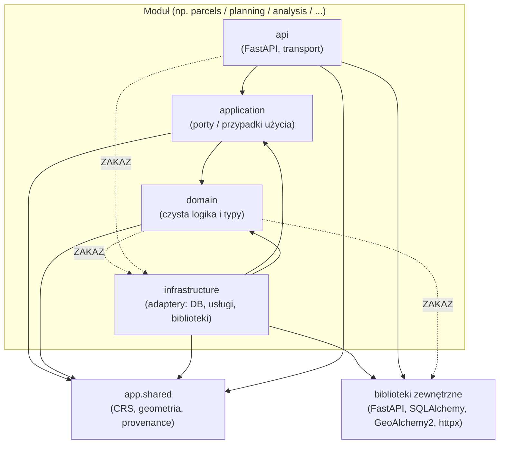

# ADR-001: Modularny monolit z trwałymi granicami modułów

- Status: Zaakceptowany
- Data: 2026-07-22
- Kontekst szerszy: ANALIZA_ARCHITEKTURY_I_PLAN.md (sekcja E, ADR-001), context.md

## Kontekst

System analizy uwarunkowań działki jest obecnie prototypem backendu FastAPI z
płaskim podziałem `router → schema → service → model/db`. Raport techniczny
(ANALIZA_ARCHITEKTURY_I_PLAN.md) wskazuje, że taka struktura sprawdza się jako
punkt startowy, ale wraz z rozwojem (import danych, wersjonowanie, MPZP/POG,
dokumenty prawne, raporty) rośnie ryzyko:

- rozjazdu odpowiedzialności między serwisami (`services/` puchnie),
- ukrytych zależności (import prywatnych funkcji innego obszaru, np. ISOK/GDOŚ
  importujące prywatne `_local_name` z KIUT),
- wciągania frameworka webowego i ORM do logiki domenowej, co utrudnia testy i
  późniejsze wydzielenie workera importu.

Potrzebujemy trwałych, egzekwowalnych granic, które porządkują kod bez kosztu i
złożoności mikroserwisów.

## Decyzja

Przyjmujemy **ewolucyjny modularny monolit**. Kod domenowy organizujemy w
moduły w `backend/app/modules/`:

`parcels`, `planning`, `documents`, `imports`, `analysis`, `provenance`,
`reporting`, `identity`.

Każdy moduł ma spójny podział na cztery warstwy:

| Warstwa | Odpowiedzialność | Może zależeć od |
|---|---|---|
| `domain` | Czysta logika i typy domenowe | biblioteka standardowa, własny `domain`, `app.shared` |
| `application` | Porty/protokoły i przypadki użycia | `domain`, `app.shared` |
| `infrastructure` | Adaptery (DB, usługi, biblioteki zewn.) | `application`, `domain`, `app.shared`, biblioteki zewnętrzne |
| `api` | Warstwa transportowa (FastAPI) | `application`, schematy transportowe |

Współdzielone, publiczne typy (kanoniczny CRS, geometria jako wartość,
provenance) mieszkają w `backend/app/shared` i są jedynym dozwolonym importem
`app.*` z warstwy `domain` (poza własnym `domain` modułu).

Granice są **egzekwowane automatycznie** przez deterministyczny test
architektoniczny oparty o analizę AST (`app/core/architecture.py`,
`tests/test_architecture.py`), uruchamiany także na kontrolowanych błędnych
fixtures.

Ten krok jest **addytywny**: dodaje szkielet modułów i test granic. Nie przenosi
istniejącej logiki z `app/services`, nie zmienia istniejących endpointów ani
modelu analiz. Migracja logiki do modułów jest osobnym, stopniowym procesem
(patrz „Strategia migracji”).

## Reguły zależności

1. `domain` może zależeć wyłącznie od biblioteki standardowej, własnych typów
   `domain` i `app.shared`. Zakaz importu FastAPI/Starlette, SQLAlchemy,
   GeoAlchemy2 oraz httpx.
2. `application` może zależeć od `domain` i `app.shared`; definiuje porty
   (protokoły).
3. `infrastructure` implementuje porty i może zależeć od `application`,
   `domain`, `app.shared` oraz bibliotek zewnętrznych.
4. `api` może zależeć od `application` i schematów transportowych; nie może
   omijać `application` i sięgać wprost do `infrastructure`.
5. Żaden moduł nie może importować prywatnych implementacji innego modułu
   (elementów z prefiksem `_` ani cudzej warstwy `infrastructure`).

## Diagram zależności

Reguła czytelna z diagramu: strzałki zależności prowadzą „do środka” (do
`domain`) oraz do `app.shared`; `domain` nie zależy od niczego poza stdlib i
`app.shared`. Zależności zaznaczone `ZAKAZ` są blokowane przez test
architektoniczny.

## Alternatywy

- **Utrzymanie płaskiej struktury `services/`.** Najniższy koszt teraz, ale
  brak egzekwowalnych granic — dług techniczny rośnie wraz z importem danych i
  modelem prawnym. Odrzucone.
- **Mikroserwisy.** Dają twarde granice procesowe, ale wprowadzają koszt
  operacyjny (sieć, wdrożenia, spójność danych) nieuzasadniony na tym etapie i
  przy jednym zespole. Odrzucone.
- **Pakiety bez wymuszania reguł (tylko konwencja).** Konwencja bez testu
  eroduje. Wybieramy moduły + automatyczny test granic.

## Strategia migracji

Migracja jest stopniowa i nie łamie działającego systemu:

1. **Faza 0 (ten ADR):** szkielet modułów, `app.shared`, test granic. Zero zmian
   w istniejących endpointach i logice.
2. **Faza 1:** nowa logika (import danych, wersjonowany model, silnik przecięć)
   powstaje od razu w modułach z zachowaniem reguł warstw.
3. **Faza 2:** istniejące serwisy przenoszone moduł po module. Dla każdego:
   - wydzielić typy do `domain`, port do `application`, adapter do
     `infrastructure`, cienki router do `api`;
   - zachować dotychczasowy publiczny kontrakt endpointu do czasu migracji
     wywołań;
   - utrzymać zielone testy na każdym kroku (żaden ruch nie jest „big bang”).
4. **Faza 3:** usunięcie zduplikowanych konfiguracji dopiero po potwierdzeniu
   kompatybilności testami.

## Opcjonalny worker

Ciężkie zadania (import danych, OCR, generowanie map i PDF) docelowo wykonuje
**worker będący drugim procesem tego samego obrazu i repozytorium** — te same
moduły domenowe, ta sama warstwa `infrastructure`, inny punkt wejścia (kolejka
zadań zamiast HTTP). Ponieważ logika żyje w `application`/`domain`, worker i API
współdzielą kod bez duplikacji i bez potrzeby wydzielania mikroserwisu.

## Konsekwencje

Pozytywne:

- Trwałe, testowalne granice; `domain` jest łatwo testowalny i wolny od IO.
- Jasny kierunek zależności ułatwia późniejsze wydzielenie workera.
- Nowa praca ma jednoznaczne miejsce (moduł + warstwa).

Koszty / ryzyka:

- Więcej pakietów i „ceremonii” dla drobnych zmian.
- Migracja istniejących serwisów jest pracochłonna i musi być stopniowa.
- Test architektoniczny wymaga utrzymania reguł wraz z rozwojem (np. dodanie
  dozwolonego wyjątku wymaga świadomej zmiany reguły i testu).
